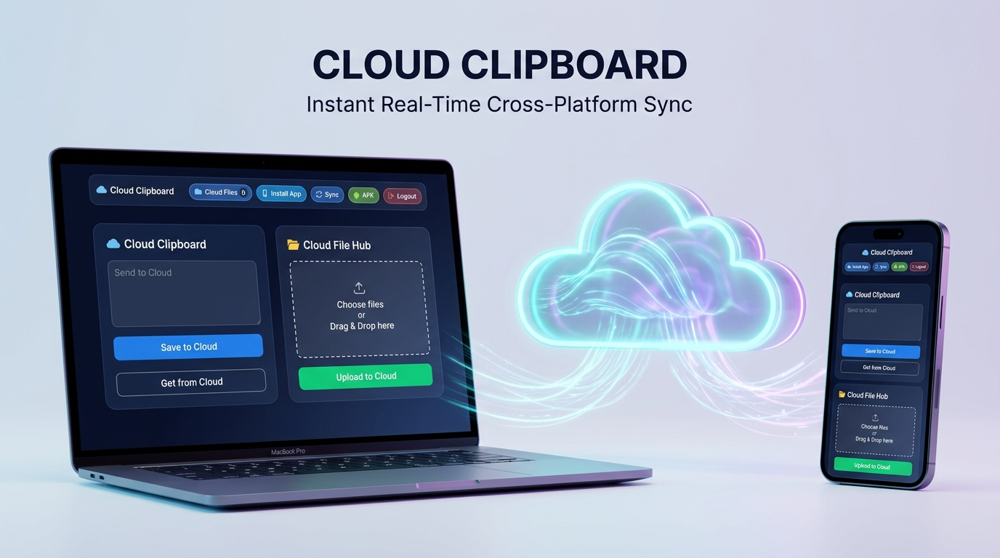

# ☁️ Cloud Clipboard

> **A seamless cross-platform clipboard and file-sharing web application built with Java Servlets, Apache Tomcat, and modern Web technologies.**



---

## 📌 Overview

**Cloud Clipboard** is designed to eliminate the frustration of having to email yourself or use messaging apps just to transfer text snippets and files between personal computers and mobile devices. 

It provides a lightweight, secure, and instant cloud-synchronized clipboard and file storage system accessible from any web browser or via the companion Android application.

---

## ✨ Key Features

- **🔐 User Authentication & Session Management**:
  - Secure User Registration and Login.
  - Interactive password visibility toggle (show/hide eye icon).
  - Session-based access control and secure logout.

- **🔑 Password Recovery with OTP Verification**:
  - Integrated *Forgot Password* workflow.
  - OTP verification system to protect user account credentials.
  - Smooth password reset capability.

- **📋 Real-Time Cloud Clipboard**:
  - Instantly save text snippets to cloud storage.
  - Retrieve synchronized clipboard content across any device in real-time.

- **📁 Cloud File Sharing (Upload & Download)**:
  - Multipart file upload system with local disk storage management (`C:/uploads/`).
  - Single-click download stream for the latest uploaded files.

- **📱 Mobile Companion Integration**:
  - Direct download link for the companion Android APK (`cloudclipboard.apk`) for instant mobile synchronization.

---

## 🛠️ Tech Stack

| Layer | Technology |
|---|---|
| **Backend** | Java (Jakarta / Java Servlets), Apache Tomcat |
| **Frontend** | HTML5, CSS3, JavaScript (AJAX & Fetch API) |
| **Architecture** | MVC Pattern & HTTP Servlet Lifecycle |
| **Storage** | File Stream Handling & Disk Persistence |
| **Mobile** | Android (`.apk` companion) |

---

## 📁 Project Structure

```
myapp/
│
├── WEB-INF/
│   └── web.xml                  # Servlet mappings and configurations
│
├── auth.html                    # User Login & Signup interface
├── index.html                   # Cloud Clipboard main dashboard
├── forgot.html                  # Forgot password request page
├── otp.html                     # OTP verification interface
├── resetPassword.html           # Reset password form
│
├── style.css                    # Modern UI styles & themes
├── script.js                    # AJAX & DOM event handlers
│
├── loginServlet.java            # Authentication & session creation
├── signupServlet.java           # User registration handler
├── logoutServlet.java           # Session termination
├── forgotServlet.java           # OTP generation handler
├── verifyOtpServlet.java        # OTP verification handler
├── resetPasswordServlet.java    # Password update servlet
│
├── ClipboardServlet.java        # Text clipboard save & retrieve logic
├── uploadServlet.java           # Multipart file upload handler
├── downloadServlet.java         # File streaming download servlet
│
├── cloudclipboard.apk           # Companion Android Application
└── cloud_clipboard_showcase.jpg # Project showcase banner
```

---

## 🚀 How to Run Locally

### Prerequisites:
- **JDK 8 or higher**
- **Apache Tomcat 9.0+**
- Modern Web Browser (Chrome, Edge, Firefox)

### Steps:
1. **Clone the repository**:
   ```bash
   git clone https://github.com/smmca2026/cloudclipoard.git
   ```
2. **Deploy on Apache Tomcat**:
   - Copy the project directory to Tomcat's `webapps/` folder, or configure the project root in Tomcat's `server.xml`.
   - Ensure `C:/uploads` exists or has write permissions for file storage.
3. **Start Apache Tomcat**:
   - Run `startup.bat` from Tomcat's `bin/` directory.
4. **Open in Browser**:
   ```
   http://localhost:8080/cloudclipboard/auth.html
   ```

---

## 👨‍💻 Author

Developed with ❤️ by **[smmca2026](https://github.com/smmca2026)**  
*Contributions, issues, and feature requests are welcome!*
